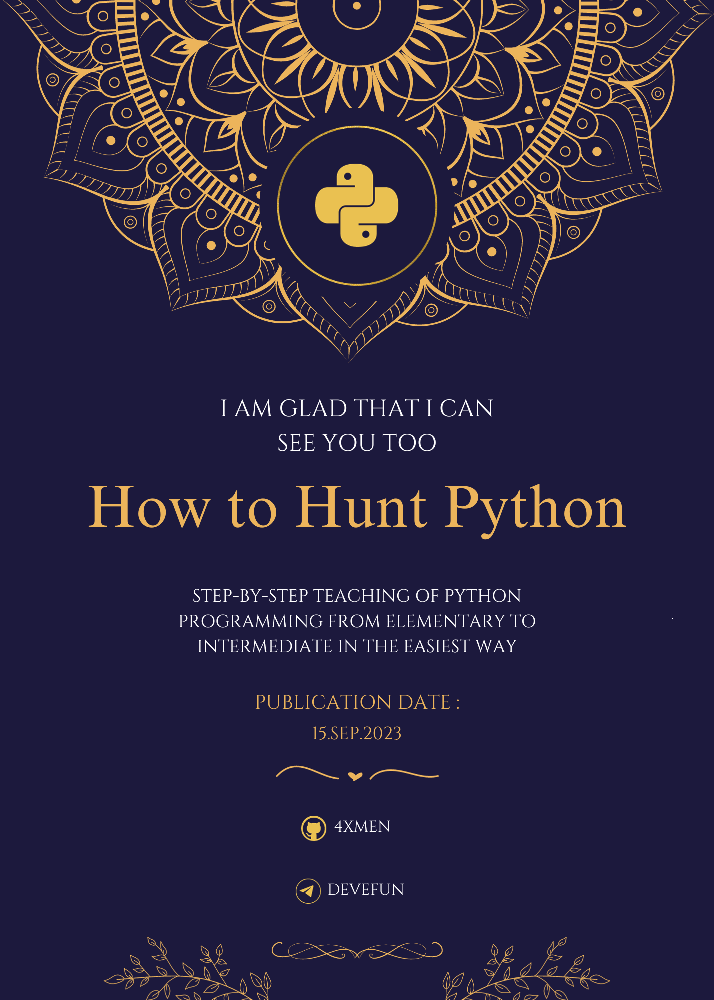

# Buch: Python-Programmierung lernen - Vom Anfänger bis zum Fortgeschrittenen von Team XStack

Im Namen Gottes

**Autoren:** Team XStack

**Veröffentlichungsdatum:** September 2023

### Languages (زبان‌ها / Sprachen)

- [English (انگلیسی)](README.md): Read the README in English.
- [German (Deutsch)](README_DE.md): Lesen Sie die README auf Deutsch.
- [Persian (فارسی)](README_FA.md): README را به زبان فارسی بخوانید.

## Einleitung

Dieses Buch, "Python-Programmierung lernen - Vom Anfänger bis zum Fortgeschrittenen," wurde von Team XStack erstellt, um Ihnen dabei zu helfen, Python als Ihre primäre Programmiersprache zu erlernen und Ihre Fähigkeiten in dieser Sprache zu erweitern.

## Buchinhalt

Unser Buch behandelt eine Vielzahl von Themen, die Sie von den grundlegenden Konzepten von Python bis hin zu fortgeschritteneren Themen führen werden. Einige der Hauptthemen im Buch sind:

- Grundlegende Python-Konzepte
- Variablen und Datentypen
- Bedingte Anweisungen und Schleifen
- Funktionen und Module
- Arbeiten mit Dateien
- Fortgeschrittene objektorientierte Konzepte
- Fehlerbehandlung
- Und vieles mehr...

## Wie man dieses Buch verwendet

Sie können dieses Buch kostenlos von unserer [Website](https://www.xstackbooks.com/python-tutorial) herunterladen und es offline oder online lesen. Sie können auch den Code und praktische Beispiele im Buch für Übungen verwenden.

## Zugriff auf das Buch

Sie können dieses Buch kostenlos von unserer [Website](https://www.xstackbooks.com/python-tutorial) herunterladen.

## Kontakt zu Team XStack

Wenn Sie Fragen, Anregungen oder Feedback zum Buch haben, würden wir uns freuen, von Ihnen zu hören. Bitte kontaktieren Sie uns über unsere [Kontaktseite](https://github.com/4xmen/Python_Learning/issues).

Wir hoffen, dass dieses Buch Ihnen hilft, die Python-Programmiersprache zu erlernen und Sie zu einem erfahrenen Programmierer in diesem Bereich macht.

---
**Autoren:** Team XStack  
**Veröffentlichungsdatum:** September 2023

